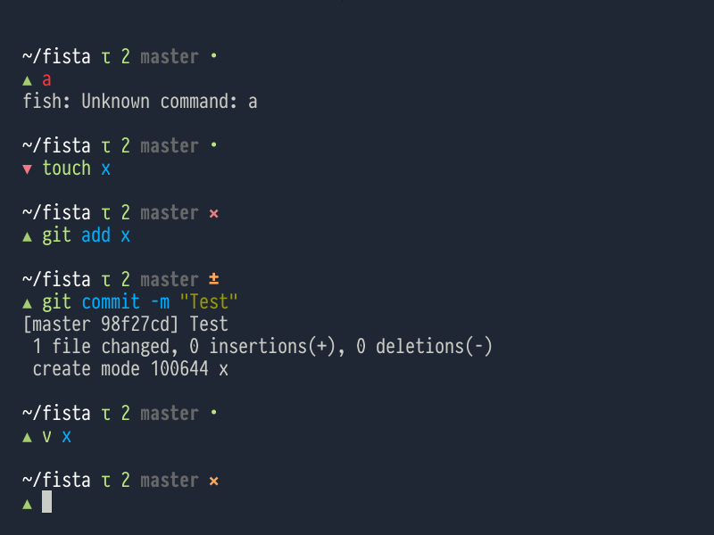

# Fshta

Minimal shell prompt based off pista by [NerdyPepper](https://github.com/NerdyPepper)

Features

* Virtualenv name (if applicable)
* Git information (if inside a git repo)
* Number of tasks from t.py (if non-zero)
* Shorten current directory name

